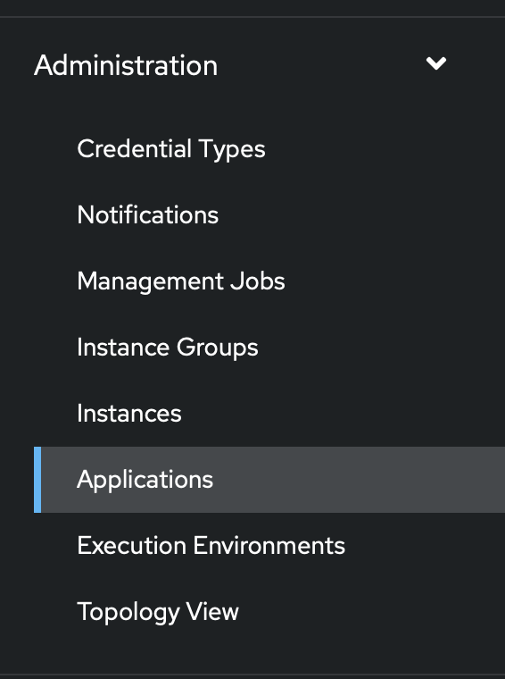

# Integrating with Ansible Automation Platform and IBM WCA

When deploying Ansible AI Connect service through operator, you will need to configure the integrations with Ansible Automation Platform and IBM watsonx Code Assistant. This is accomplished by providing `Secret`s with the necessary configuration details.

## Table of Contents
- [Integrating with Ansible Automation Platform and IBM WCA](#integrating-with-ansible-automation-platform-and-ibm-wca)
  - [Table of Contents](#table-of-contents)
  - [Integrating with Ansible Automation Platform](#integrating-with-ansible-automation-platform)
    - [Create An Application in AAP](#create-an-application-in-aap)
    - [When instantiating Ansible Lightspeed CR](#when-instantiating-ansible-lightspeed-cr)
    - [After Ansible Lightspeed CR is created](#after-ansible-lightspeed-cr-is-created)
  - [Integrating with IBM watsonx Code Assistant](#integrating-with-ibm-watsonx-code-assistant)
    - [IBM watsonx Code Assistant - Cloud Pack for Data (CPD)](#ibm-watsonx-code-assistant---cloud-pack-for-data-cpd)
    - [IBM watsonx Code Assistant - IBM Cloud](#ibm-watsonx-code-assistant---ibm-cloud)

## Integrating with Ansible Automation Platform

Lightspeed service depends on a deployed instance of Ansible Automation Platform (AAP).  The following steps describe how you can configure it.

### Create An Application in AAP

* Login to your AAP
* In the left hand side navigation menu, click `Administration/Application`

  
  
* Click `Add` to create a new application
* Fill in the application details. This is an example
  
  
  * Note that you won't have the exact `Redirect URIs` yet. For now, just enter a valid URL and we will come back to update it after installation of Lightspeed.
  * After clicking `Save`, a pop up with `Client ID` and `Client secret` will show up.
  * Copy the `Client secret` and store it in a secured storage (e.g. secrets vault) because you will not be able to retrieve it after dismissing the popup.
* Now you will have collected the following
  * The application `Client ID` 
  * The application `Client secret` 
  * The AAP API URL which is normally `<aap_web_url>/api/`

### Authentication `Secret` content

When you create a `Secret` for the Authentication configuration in the OpenShift cluster, the following pieces of information collected from the above will help:
1. `auth_api_key`: The application `Client ID`
2. `auth_api_secret`: The application `Client secret`
3. `auth_api_url`: The AAP API URL `<aap_web_url>/api/`

See [here](using-external-configuration-secrets.md#authentication-secret) for more instructions regarding configuration with `Secret`s.

### After Ansible Lightspeed CR is created

* A route to the Lightspeed API service will be provisioned in the namespace
* Revisit the application object you have created in the [Create An Application in AAP](#create-an-application-in-aap) section
* Update the `Redirect URIs` field with `<lightspeed_route>/complete/aap/` where `<lightspeed_route>` is the route you just obtained.

## Integrating with IBM watsonx Code Assistant

Currently, IBM watsonx Code Assistant can be delivered through a "cloud" version and an "on-premise" version, the Cloud Pack for Data. Lightspeed service can integrate with either of them.

### IBM watsonx Code Assistant - Cloud Pack for Data (CPD)

#### Authentication `Secret` content

When you create a `Secret` for the Model configuration in the OpenShift cluster, the following pieces of information collected from the above will help:
1. `model_url`: The URL to your Cloud Pack for Data instance 
2. `model_api_key`: [Cloud Pack for Data API key](https://www.ibm.com/docs/en/cloud-paks/cp-data/4.8.x?topic=steps-generating-api-keys) 
3. `model_name`: An e.g.: `8e7de79b-8bc2-43cc-9d20-c4207cd92fec<|sepofid|>granite-3b`
4. `username`: The username that has access to the model/space
5. `model_type`: The literal value `"wca-onprem"`.

See [here](using-external-configuration-secrets.md#authentication-secret) for more instructions regarding configuration with `Secret`s.

### IBM watsonx Code Assistant - IBM Cloud

#### Authentication `Secret` content

When you create a `Secret` for the Model configuration in the OpenShift cluster, the following pieces of information collected from the above will help:
1. `model_url`: The URL to IBM Cloud `https://dataplatform.cloud.ibm.com`
2. `model_api_key`: API key obtained from your IBM Cloud account
3. `model_name`: An e.g.: `8e7de79b-8bc2-43cc-9d20-c4207cd92fec<|sepofid|>granite-3b`
4. `model_type`: The literal value `"wca"`.

See [here](using-external-configuration-secrets.md#authentication-secret) for more instructions regarding configuration with `Secret`s.
